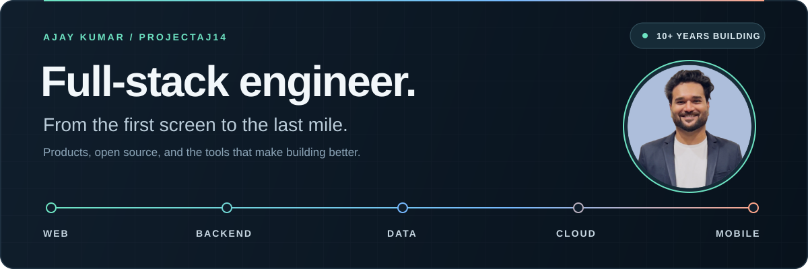

<p align="center">
  
</p>

# Hey, I'm Ajay.

**Full-stack engineer · 10+ years building software · Open-source builder & speaker**

I build products end to end: the interface people use, the APIs behind it, the data they depend on, and the path to production. My work spans React and TypeScript, Java and Spring Boot, databases, cloud, and mobile.

Flutter has been a big part of my journey. These days, I work across the stack, and I still enjoy turning the awkward, repetitive parts of development into tools other people can use.

[LinkedIn](https://linkedin.com/in/ajaykumar2114) &nbsp; / &nbsp; [Writing](https://medium.com/@ajay.kumar_14) &nbsp; / &nbsp; [YouTube](https://www.youtube.com/channel/UCyV2fy32RyPgOco83tMkR-g) &nbsp; / &nbsp; [Stack Overflow](https://stackoverflow.com/users/2868455)

---

## Across the stack

| Layer | What I work with |
| :--- | :--- |
| **Web** | React, TypeScript, JavaScript, MUI, HTML & CSS |
| **Backend** | Java, Spring Boot, Django, Firebase |
| **Data** | MongoDB, MySQL, SQLite |
| **Cloud & delivery** | Google Cloud, Docker, GitHub Actions, Jenkins, Linux |
| **Mobile** | Flutter, Dart, Kotlin, Swift, Android & iOS |

I like being able to follow a feature all the way through: from a screen, through an API, down to the data, and out into a release. That context makes the individual decisions better.

## A few things I've built

### [Eklavya ↗](https://github.com/ProjectAJ14/eklavya)
**Developer tools · TypeScript · AI-assisted learning**

A Claude Code plugin that asks you about the concepts behind the code your agent just wrote. Adaptive questions, spaced repetition, and a local knowledge graph help you understand what you're shipping.

[Explore the docs](https://eklavya-run.web.app/docs/)

### [Morph ↗](https://github.com/ProjectAJ14/Morph)
**Desktop · TypeScript · AI**

Copy a rough message, hit a shortcut, and paste a version formatted for Slack, Teams, or Markdown. A small app built around a task I wanted to make easier.

[Get the app](https://projectaj14.github.io/Morph/)

### [Flutter Coverage Action ↗](https://github.com/ProjectAJ14/flutter-coverage-action)
**CI/CD · GitHub Actions · Developer experience**

Turns Flutter test coverage into browsable reports on GitHub Pages, so the results are easier to inspect during review.

[See a report](https://projectaj14.github.io/flutter-coverage-action/coverage/)

### [dzod ↗](https://pub.dev/packages/dzod)
**Dart · Schema validation · Libraries**

Zod-inspired schema validation for Dart, with type-safe parsing and validation. Part of my broader work on reusable Dart and Flutter packages.

<details>
<summary><b>More from my Dart & Flutter toolbox</b></summary>

- [timer_button](https://pub.dev/packages/timer_button) — Buttons with a timed delay before they can be pressed.
- [connectivity_wrapper](https://pub.dev/packages/connectivity_wrapper) — Connection feedback for Flutter apps.
- [ns_utils](https://pub.dev/packages/ns_utils) — Everyday Flutter utilities and extensions.
- [ns_firebase_utils](https://pub.dev/packages/ns_firebase_utils) — Helpers for Firebase integration.
- [ns_upi](https://pub.dev/packages/ns_upi) — Discover UPI apps and initiate payments.
- [nonstop_cli](https://pub.dev/packages/nonstop_cli) — Generate Flutter projects, features, and schemas.
- [flutter_diff_action](https://github.com/ProjectAJ14/flutter_diff_action) — Run Flutter and Dart commands with diff checks.
- [cli_core](https://pub.dev/packages/cli_core) — Shared utilities for CLI and workspace operations.
- [ns_intl_phone_input](https://pub.dev/packages/ns_intl_phone_input) — International phone number input.
- [html_rich_text](https://pub.dev/packages/html_rich_text) — Lightweight HTML-styled text rendering.
- [morse_tap](https://pub.dev/packages/morse_tap) — Gesture-based Morse code input.
- [contact_permission](https://pub.dev/packages/contact_permission) — Request and check contact permissions.

</details>

## Sharing what I learn

I write, make videos, and run technical sessions. Past talks and workshops have covered Flutter & AI, Dart DevTools, Go Router, API integration, BLoC, and Git for kids.

[Flutter & AI Fusion: Powering Apps with Intelligence](https://www.linkedin.com/posts/ajaykumar2114_flutter-flutternagpur-fluttercommunity-activity-7167534526716428288-DBK4)

### From the blog

<!-- BLOG-POST-LIST:START -->
- [Deep Dive into Flutter Create](https://blog.nonstopio.com/deep-dive-into-flutter-create-f629f3926d82?source=rss-809bf38703df------2)
- [How to use environment variables in Flutter?](https://blog.nonstopio.com/how-to-use-environment-variables-in-flutter-90cfc882177d?source=rss-809bf38703df------2)
- [Flutter’s Device Preview: Get a Sneak Peek of Your App’s Appearance on Any Device](https://blog.nonstopio.com/flutters-device-preview-get-a-sneak-peek-of-your-app-s-appearance-on-any-device-c55526604588?source=rss-809bf38703df------2)
- [Discover How Flutter is Built with Dart Using the Power of S.O.L.I.D Principles!](https://blog.nonstopio.com/discover-how-flutter-is-built-with-dart-using-the-power-of-s-o-l-i-d-principles-459781210913?source=rss-809bf38703df------2)
- [Host Flutter Web on Github Pages using Github Actions #FREE](https://blog.nonstopio.com/host-flutter-web-on-github-pages-using-github-actions-free-168585ec2981?source=rss-809bf38703df------2)
<!-- BLOG-POST-LIST:END -->

<details>
<summary>Activity stats</summary>

These automated stats reflect tracked activity and public repositories, rather than the full range of my work.

<!--START_SECTION:waka-->


**I'm a Night 🦉** 

```text
🌞 Morning                338 commits         ███░░░░░░░░░░░░░░░░░░░░░░   13.08 % 
🌆 Daytime                859 commits         ████████░░░░░░░░░░░░░░░░░   33.24 % 
🌃 Evening                1080 commits        ██████████░░░░░░░░░░░░░░░   41.80 % 
🌙 Night                  307 commits         ███░░░░░░░░░░░░░░░░░░░░░░   11.88 % 
```
📅 **I'm Most Productive on Monday** 

```text
Monday                   673 commits         ███████░░░░░░░░░░░░░░░░░░   26.04 % 
Tuesday                  598 commits         ██████░░░░░░░░░░░░░░░░░░░   23.14 % 
Wednesday                180 commits         ██░░░░░░░░░░░░░░░░░░░░░░░   06.97 % 
Thursday                 316 commits         ███░░░░░░░░░░░░░░░░░░░░░░   12.23 % 
Friday                   541 commits         █████░░░░░░░░░░░░░░░░░░░░   20.94 % 
Saturday                 123 commits         █░░░░░░░░░░░░░░░░░░░░░░░░   04.76 % 
Sunday                   153 commits         █░░░░░░░░░░░░░░░░░░░░░░░░   05.92 % 
```


📊 **This Week I Spent My Time On** 

```text
🕑︎ Time Zone: Asia/Kolkata

💬 Programming Languages: 
YAML                     5 hrs 39 mins       █████████████░░░░░░░░░░░░   51.61 % 
Dart                     2 hrs 26 mins       ██████░░░░░░░░░░░░░░░░░░░   22.21 % 
Makefile                 1 hr 45 mins        ████░░░░░░░░░░░░░░░░░░░░░   15.97 % 
justfile                 48 mins             ██░░░░░░░░░░░░░░░░░░░░░░░   07.39 % 
Markdown                 8 mins              ░░░░░░░░░░░░░░░░░░░░░░░░░   01.32 % 

🔥 Editors: 
IntelliJ IDEA            5 hrs 42 mins       █████████████░░░░░░░░░░░░   51.96 % 
Android Studio           5 hrs 16 mins       ████████████░░░░░░░░░░░░░   48.04 % 

💻 Operating System: 
Mac                      10 hrs 58 mins      █████████████████████████   100.00 % 
```

**I Mostly Code in Dart** 

```text
Dart                     41 repos            ████████████████░░░░░░░░░   62.12 % 
C++                      14 repos            █████░░░░░░░░░░░░░░░░░░░░   21.21 % 
Kotlin                   3 repos             █░░░░░░░░░░░░░░░░░░░░░░░░   04.55 % 
MDX                      1 repo              ░░░░░░░░░░░░░░░░░░░░░░░░░   01.52 % 
D2                       1 repo              ░░░░░░░░░░░░░░░░░░░░░░░░░   01.52 % 
```
<!--END_SECTION:waka-->

</details>

---

**Let's talk software.** For a project, an open-source collaboration, or a session on full-stack engineering or Flutter, [reach me on LinkedIn](https://linkedin.com/in/ajaykumar2114).
