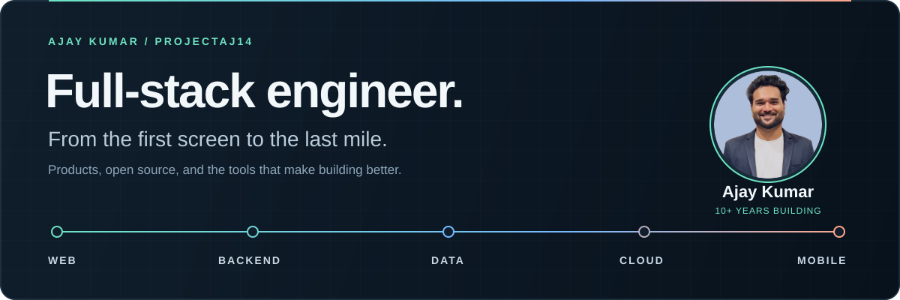

<p align="center">
  
</p>

# Hey, I'm Ajay.

**Full-stack engineer · 10+ years building software · Open-source builder & speaker**

I build products end to end: the interface people use, the APIs behind it, the data they depend on, and the path to production. Right now, most of my work is in **React / TypeScript** and **Java / Spring Boot**, with databases, cloud, and mobile rounding out the stack.

Flutter has been a big part of my journey. These days, I work across the stack, and I still enjoy turning the awkward, repetitive parts of development into tools other people can use.

[LinkedIn](https://linkedin.com/in/ajaykumar2114) &nbsp; / &nbsp; [Writing](https://medium.com/@ajay.kumar_14) &nbsp; / &nbsp; [YouTube](https://www.youtube.com/channel/UCyV2fy32RyPgOco83tMkR-g) &nbsp; / &nbsp; [Stack Overflow](https://stackoverflow.com/users/2868455)

---

## Building in public

Products I build and maintain. Most are solo projects.

<table>
<tr>
<td width="50%" valign="top">
<h3>🧠 <a href="https://github.com/ProjectAJ14/eklavya">Eklavya</a></h3>
<p>A Claude Code plugin that helps you understand the code your agent writes, with adaptive questions and a local knowledge graph.</p>
<p><sub>TypeScript · Developer tools · Learning</sub></p>
<a href="https://eklavya-run.web.app/docs/">Read the docs →</a>
</td>
<td width="50%" valign="top">
<h3>✍️ <a href="https://github.com/ProjectAJ14/Morph">Morph</a></h3>
<p>Copy a rough message, hit a shortcut, and paste a version formatted for Slack, Teams, or Markdown.</p>
<p><sub>TypeScript · Desktop · AI</sub></p>
<a href="https://projectaj14.github.io/Morph/">Get the app →</a>
</td>
</tr>
</table>

---

<h2 align="center">My toolbox</h2>

<p align="center">
  <strong>My daily stack</strong><br /><br />
  <br />
  <sub>React & TypeScript on the frontend · Java & Spring Boot on the backend</sub>
</p>

<table align="center">
<tr>
<td width="50%" valign="top" align="center">
<strong>Web & APIs</strong><br /><br />

<p><sub>Next.js · JavaScript · Tailwind · MUI · Node.js · Django</sub></p>
</td>
<td width="50%" valign="top" align="center">
<strong>Data & cloud</strong><br /><br />

<p><sub>Firebase · MongoDB · MySQL · SQLite · Google Cloud · Docker</sub></p>
</td>
</tr>
<tr>
<td width="50%" valign="top" align="center">
<strong>Mobile & desktop</strong><br /><br />

<p><sub>Flutter · Dart · Kotlin · Swift · Electron</sub></p>
</td>
<td width="50%" valign="top" align="center">
<strong>Tools & delivery</strong><br /><br />

<p><sub>Git · GitHub Actions · Linux · Jenkins · Figma</sub></p>
</td>
</tr>
</table>

---

<h2 align="center">AI tools in my daily workflow</h2>

<p align="center">
  I use AI agents and tools heavily in my day-to-day work.<br />
  These are the ones I keep coming back to.
</p>

<p align="center">
  
  
  <br />
  
  
  <br />
  
  
  <br />
  
  
</p>

---

## More open-source work

More of my open-source work, from everyday developer tools to reusable libraries.

### 🧭 [JSON Viewer](https://github.com/nonstopio/json-viewer)
**React · TypeScript · Tailwind CSS · Vite**

A browser-based JSON explorer with tree and graph views, search, and a navigator for large documents. Shareable deep links open JSON directly in the viewer, with parsing handled entirely in the browser.

[Try it](https://json.nonstopio.com) &nbsp; / &nbsp; [Source code](https://github.com/nonstopio/json-viewer)

### 🎙️ [Narad Muni](https://github.com/nonstopio/Narad-Muni)
**Next.js · TypeScript · Electron · Firebase · AI integrations**

A desktop app that turns a voice recording or typed update into formatted Slack and Teams messages and Jira work logs. AI extracts tasks, blockers, and time entries; you review the output before publishing.

[Get the app](https://nonstopio.github.io/Narad-Muni/) &nbsp; / &nbsp; [Source code](https://github.com/nonstopio/Narad-Muni)

### 🔨 [Flutter Forge](https://github.com/nonstopio/flutter_forge)
**Dart · Flutter · Melos · CLI tooling · GitHub Actions**

A collection of Dart and Flutter packages, plugins, and CLI tools. NonStop CLI generates app starters with tests and CI; packages such as dzod, html_rich_text, and morse_tap cover schema validation, rich text, and gesture-based input.

[Explore the packages](https://github.com/nonstopio/flutter_forge/tree/main/packages) &nbsp; / &nbsp; [NonStop CLI](https://pub.dev/packages/nonstop_cli) &nbsp; / &nbsp; [dzod](https://pub.dev/packages/dzod)

---

**[Flutter Coverage Action](https://github.com/ProjectAJ14/flutter-coverage-action)** — Browsable Flutter coverage reports on GitHub Pages. [See a report ↗](https://projectaj14.github.io/flutter-coverage-action/coverage/)

<details>
<summary><b>More from my Dart & Flutter toolbox</b></summary>

- [timer_button](https://pub.dev/packages/timer_button) — Buttons with a timed delay before they can be pressed.
- [connectivity_wrapper](https://pub.dev/packages/connectivity_wrapper) — Connection feedback for Flutter apps.
- [ns_utils](https://pub.dev/packages/ns_utils) — Everyday Flutter utilities and extensions.
- [ns_firebase_utils](https://pub.dev/packages/ns_firebase_utils) — Helpers for Firebase integration.
- [ns_upi](https://pub.dev/packages/ns_upi) — Discover UPI apps and initiate payments.
- [nonstop_cli](https://pub.dev/packages/nonstop_cli) — Generate Flutter projects, features, and schemas.
- [flutter_diff_action](https://github.com/ProjectAJ14/flutter_diff_action) — Run Flutter and Dart commands with diff checks.
- [cli_core](https://pub.dev/packages/cli_core) — Shared utilities for CLI and workspace operations.
- [ns_intl_phone_input](https://pub.dev/packages/ns_intl_phone_input) — International phone number input.
- [html_rich_text](https://pub.dev/packages/html_rich_text) — Lightweight HTML-styled text rendering.
- [morse_tap](https://pub.dev/packages/morse_tap) — Gesture-based Morse code input.
- [contact_permission](https://pub.dev/packages/contact_permission) — Request and check contact permissions.

</details>

## Sharing what I learn

I write, make videos, and run technical sessions. Past talks and workshops have covered Flutter & AI, Dart DevTools, Go Router, API integration, BLoC, and Git for kids.

[Flutter & AI Fusion: Powering Apps with Intelligence](https://www.linkedin.com/posts/ajaykumar2114_flutter-flutternagpur-fluttercommunity-activity-7167534526716428288-DBK4)

### From the blog

<!-- BLOG-POST-LIST:START -->
- [Deep Dive into Flutter Create](https://blog.nonstopio.com/deep-dive-into-flutter-create-f629f3926d82?source=rss-809bf38703df------2)
- [How to use environment variables in Flutter?](https://blog.nonstopio.com/how-to-use-environment-variables-in-flutter-90cfc882177d?source=rss-809bf38703df------2)
- [Flutter’s Device Preview: Get a Sneak Peek of Your App’s Appearance on Any Device](https://blog.nonstopio.com/flutters-device-preview-get-a-sneak-peek-of-your-app-s-appearance-on-any-device-c55526604588?source=rss-809bf38703df------2)
- [Discover How Flutter is Built with Dart Using the Power of S.O.L.I.D Principles!](https://blog.nonstopio.com/discover-how-flutter-is-built-with-dart-using-the-power-of-s-o-l-i-d-principles-459781210913?source=rss-809bf38703df------2)
- [Host Flutter Web on Github Pages using Github Actions #FREE](https://blog.nonstopio.com/host-flutter-web-on-github-pages-using-github-actions-free-168585ec2981?source=rss-809bf38703df------2)
<!-- BLOG-POST-LIST:END -->

<details open>
<summary><b>📊 Activity stats</b></summary>

<sub>Typical week · estimated hours and language mix</sub>

**💻 Coding time — ~66 hrs 06 min / week**

```text
Monday      11 hrs 42 min  ███████████████████████░
Tuesday     11 hrs 57 min  ████████████████████████
Wednesday   11 hrs 36 min  ███████████████████████░
Thursday    11 hrs 53 min  ████████████████████████
Friday      11 hrs 47 min  ████████████████████████
Saturday     3 hrs 23 min  ███████░░░░░░░░░░░░░░░░░
Sunday       3 hrs 48 min  ████████░░░░░░░░░░░░░░░░
```

**🧩 Languages & frameworks**

```text
Java · Spring Boot   ~29 hrs 45 min  █████████░░░░░░░░░░░  ~45%
TypeScript · React   ~26 hrs 26 min  ████████░░░░░░░░░░░░  ~40%
JavaScript           ~ 6 hrs 37 min  ██░░░░░░░░░░░░░░░░░░  ~10%
Dart · Flutter       ~ 3 hrs 18 min  █░░░░░░░░░░░░░░░░░░░  ~5%
```

**🛠️ Daily workflow** &nbsp; React + TypeScript · Java + Spring Boot · Codex

</details>

---

<p align="center"><strong>Find me around the internet</strong></p>
<p align="center">
  <a href="https://linkedin.com/in/ajaykumar2114"></a>
  <a href="https://www.instagram.com/iajaykumar_14"></a>
  <a href="https://medium.com/@ajay.kumar_14"></a>
  <a href="https://stackoverflow.com/users/2868455"></a>
  <a href="https://twitter.com/AjayK_14"></a>
  <a href="https://www.youtube.com/channel/UCyV2fy32RyPgOco83tMkR-g"></a>
  <a href="https://www.buymeacoffee.com/projectaj"></a>
</p>
